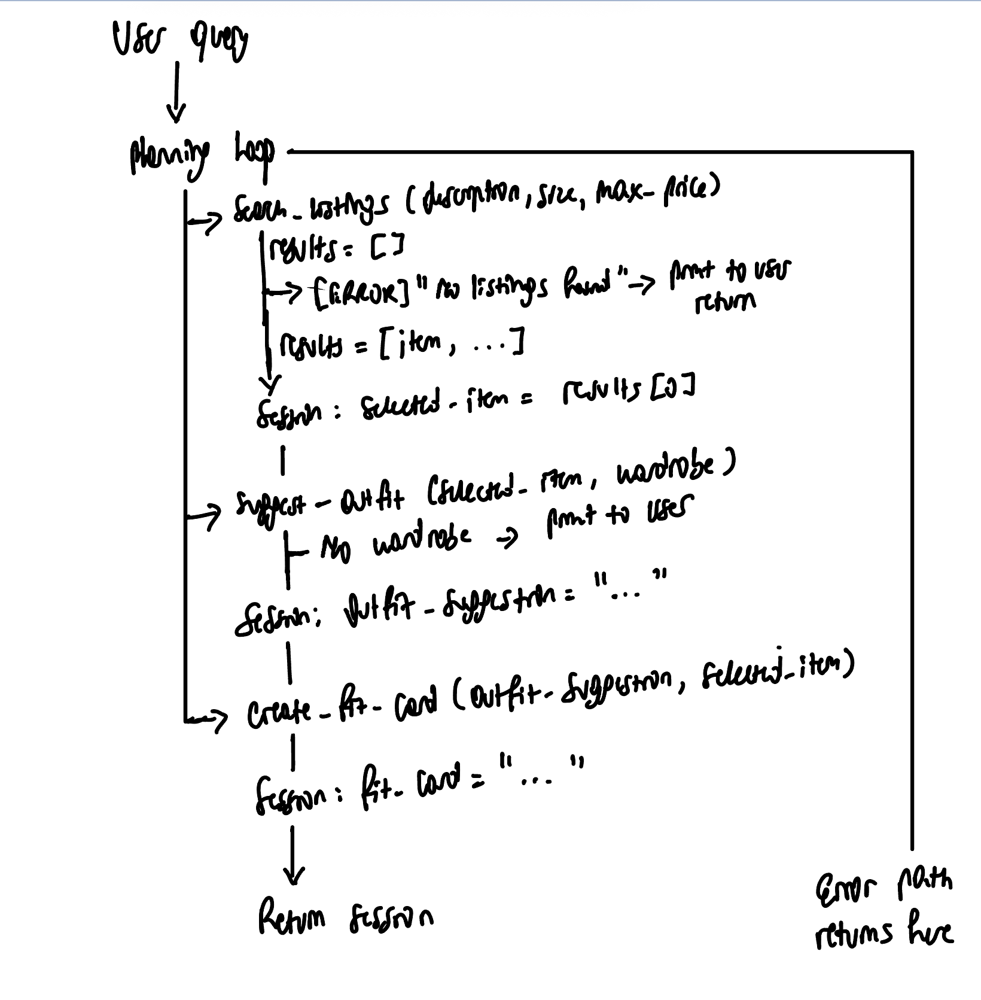

# FitFindr — planning.md

> Complete this document before writing any implementation code.
> Your spec and agent diagram are what you'll use to direct AI tools (Claude, Copilot, etc.) to generate your implementation — the more specific they are, the more useful the generated code will be.
> Your planning.md will be reviewed as part of your submission.
> Update it before starting any stretch features.

---

## Tools

List every tool your agent will use. For each tool, fill in all four fields.
You must have at least 3 tools. The three required tools are listed — add any additional tools below them.

### Tool 1: search_listings

**What it does:** Searches for all matching listings in listings.json dataset according to user input parameters. For description, it searches the title, description or style_tags and colors to find atleast one or more matching words as input description. For size, this method should establish a range for items with digit sizes and convert them to either XS(extra small), S(small), M(medium), L(large). For max_price find something that is less than or equal to the input max_price.

<!-- Describe what this tool does in 1–2 sentences -->

**Input parameters:**

<!-- List each parameter, its type, and what it represents -->

- `description` (str): String to be matched against available listings. This is what the user wants
- `size` (str): The cloth size
- `max_price` (float): Maximum money they can spend on the mentioned cloth

**What it returns:** Returns a list of filtered listings

<!-- Describe the return value — what fields does a result contain? -->

**What happens if it fails or returns nothing:** Suggest to the user to change one of the three inputs and provide another value. Call again this method on the new parameters. If an error happens, should ask user to enter their search again, i.e description , size, max_price and the search_listings should be called again.

<!-- What should the agent do if no listings match? -->

---

### Tool 2: suggest_outfit

**What it does:** Pairs the returned item from search_listings and tries to reasonably match it with items in the user wardrobe. Forexample, you can't match a t-shirt with another t-shirt It has to be reasonable in that it forms a complete outfit that the user can wear without adding other things.

<!-- Describe what this tool does in 1–2 sentences -->

**Input parameters:**

<!-- List each parameter, its type, and what it represents -->

- `new_item` (dict): Chosen thrift item from search_listings
- `wardrobe` (dict): user's wardrobe

**What it returns:** List of possible outfit combinations

<!-- Describe the return value -->

**What happens if it fails or returns nothing:** If the user provides no wardrobe, just describes the new_item the got from search_listings. If it fails, output to user, "Coming up with a good outfit to match your new item..." and try calling suggest_outfit() again.

<!-- What should the agent do if the wardrobe is empty or no outfit can be suggested? -->

---

### Tool 3: create_fit_card

**What it does:** Gives an instagram post caption or just interesting and fun description of the outfit suggestion from suggest_outfit() and return that

<!-- Describe what this tool does in 1–2 sentences -->

**Input parameters:**

<!-- List each parameter, its type, and what it represents -->

- `outfit` (str): Outfit suggestion from suggest_outfit())
- `new_item` (dict): The new thrifted item from search_listings()

**What it returns:** Returns a description of the suggested outfit

<!-- Describe the return value -->

**What happens if it fails or returns nothing:** If it fails or nothing is returned, print "This is the suggested outfit + outfit parameter from suggest_outfit()".

<!-- What should the agent do if the outfit data is incomplete? -->

---

### Additional Tools (if any)

<!-- Copy the block above for any tools beyond the required three -->

---

## Planning Loop

**How does your agent decide which tool to call next?**

_After search_listings runs, check if results is empty. If it's empty because of the tool failure, set an error message in the session and return early. If it's empty because no matching listings were found, le the user know that there's no outfit like that and ask them to try searching for something else. If a result is returned, set selected_item = result and proceed to suggest_outfit()._

Ask the user if they have a wardrobe before calling suggest_outfit(). Then call suggest_outfit() with the result of search_listings and the result of get_example_wardrobe() from data_loader.py as the user wardrobe if they answered that they have a wardrobe. If they say they don't have a wardrobe, pass in an empty wardrobe in suggest_outfit() instead.

After suggest_outfit() is run, if a result is returned, call create_fit_card() with the result of suggest_outfit() and the result of search_listings(). Return the result of create_fit_card() to the user if everything is successful at this point.

<!-- Describe the logic your planning loop uses. What does it look at? What conditions change its behavior? How does it know when it's done? -->

---

## State Management

**How does information from one tool get passed to the next?**

For each session, a session object(dictionary) is created to store the full data records from listings.json that will need to be passed around between the tools. Tools have access to these full records but they only the item IDs and any minimal information to the LLM to avoid the LLM having to store large objects in its context.

---

## Error Handling

For each tool, describe the specific failure mode you're handling and what the agent does in response.

| Tool            | Failure mode                          | Agent response                                                                                            |
| --------------- | ------------------------------------- | --------------------------------------------------------------------------------------------------------- |
| search_listings | No results match the query            | Print("No matching items! Try other styles")"                                                             |
| suggest_outfit  | Wardrobe is empty                     | Print("No worries! Let's start building a wardrobe for you. The chosen {new_item} is a good start!") |
| create_fit_card | Outfit input is missing or incomplete | Print("How do you like, {new_item}"")                                                                     |

---

## Architecture

---

## AI Tool Plan

<!-- For each part of the implementation below, describe:
     - Which AI tool you plan to use (Claude, Copilot, ChatGPT, etc.)
     - What you'll give it as input (which sections of this planning.md, your agent diagram)
     - What you expect it to produce
     - How you'll verify the output matches your spec before moving on

     "I'll use AI to help me code" is not a plan.
     "I'll give Claude my Tool 1 spec (inputs, return value, failure mode) and ask it to implement
     search_listings() using load_listings() from the data loader — then test it against 3 queries
     before trusting it" is a plan. -->

**Milestone 3 — Individual tool implementations:**

1. search_listings(): I'll give Claude the Tool1 section of planning.md and ask it to create the function that filters the loaded listings from load_listings according to the description, size, and max_price parameters. I'll verify that it handles even the case where one or more parameter is missing and that the returned filtered list matches all three parameters. I'll do this through 3 queries.
2. suggest_outfit(): I'll give Claude the Tool2 section of planning.md and ask it to create the function. I'll verify that possible and valid outfit combinations were given, to test things like matching a t-shirt with a t-shirt wouldn't make sense. I'll run 2 tests to verify this.
3. create_fit_card(): I'll give Claude the Tool2 section of planning.md and ask it to create the function. I'll test that the returned fit description is not just a plain description, but is an exciting description something you would tell your friends or post. I'll run another test to see what happens if something has failed in between, that it returns the previous valid state. i.e just print the outfit chosen is {outfit_suggested} if tool 2 was successful

**Milestone 4 — Planning loop and state management:**

I'll use Claude and point it to the Planning Loop and State Management sections of planning.md to have it implement a proper execution flow where each tool is called in the right order and that state data is correctly updated and passed along to the next tool and that finally a result is returned to the user.

---

## A Complete Interaction (Step by Step)

Write out what a full user interaction looks like from start to finish — tool call by tool call. Use a specific example query.

**Example user query:** "I'm looking for a vintage graphic tee under $30. I mostly wear baggy jeans and chunky sneakers. What's out there and how would I style it?"

**Step 1:** Call search_listing("vintage graphic tee", size="", max_price=30). This will search in listings data for matches where the description or style_tags includes one of the words in the input, "vintage graphic tee" and where the price is below 30. Any size is good here as its not specified by the user.

Return the first item in this filtered list. For this query, something like Graphic Tee — 2003 Tour Bootleg Style is good, it's under 30 and has both vintage and graphic tee in style_tags.

**Step 2:** Call suggest_outfit() with Graphic Tee — 2003 Tour Bootleg Style and the example wardrobe loaded from data_loader.py with get_example_wardrobe() can then return a bottom type of cloth, forexample Wide-leg khaki trousers. If user has no wardrobe, this method just tells return an outfit suggestion with only the thrifted new_item. If however, a good outfit combination is found, this method then return an interesting description of the outfit. Forexample, "Pairing this Graphic Tee 2003 Tour Bootleg Style with Wide-leg khaki trousers would make a contemporary but also vintage look that is popping up right now.""

**Step 3:**Call create_fit_ard() with the outfit description from step 2 as input and the new_item thrifted from step1. In this method, a summary of what the user thrifted is returned in a way that it resembles like an instagram post showing excitement about what they bought. Something like, "This has to be a one-of-a kind thrift runs I had today, pairing this Graphic Tee 2003 Tour Bootleg Style with Wide-leg khaki trousers will definitely be good."

**Final output to user:** "This has to be a one-of-a kind thrift runs I had today, pairing this Graphic Tee 2003 Tour Bootleg Style with Wide-leg khaki trousers will definitely be good."

<!-- What does the user actually see at the end? -->
